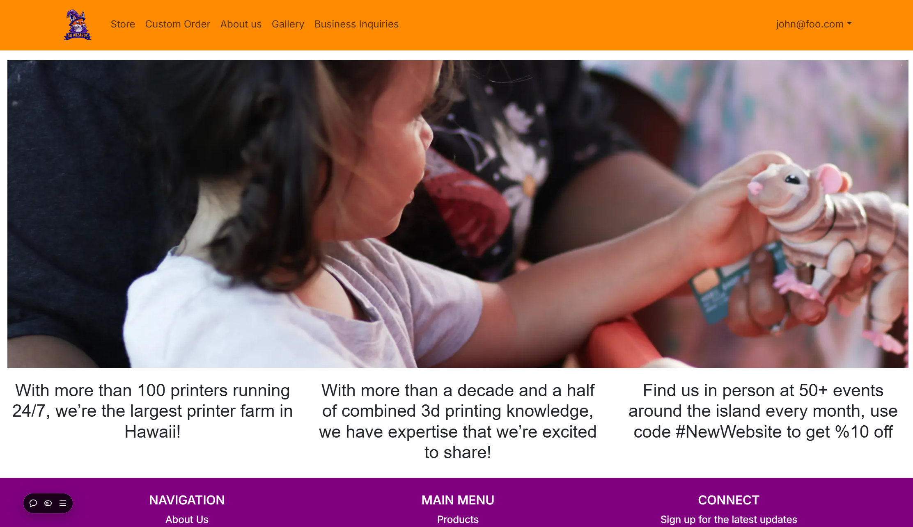
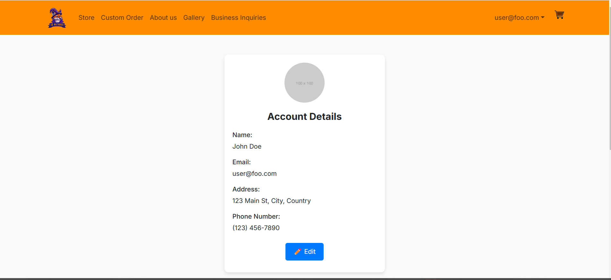
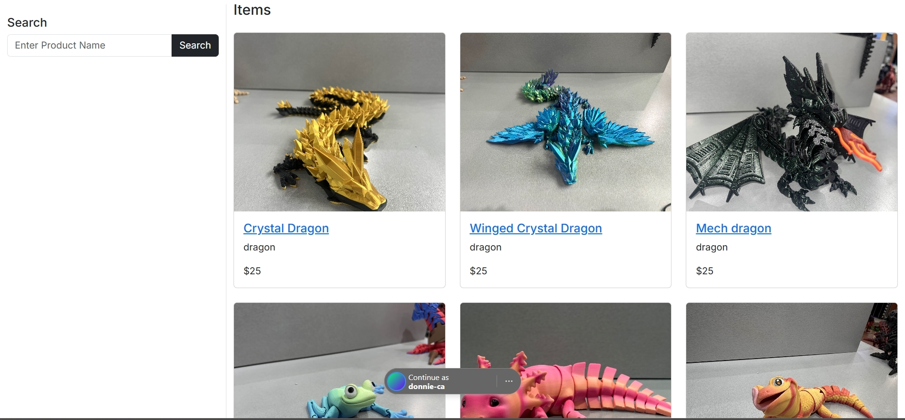
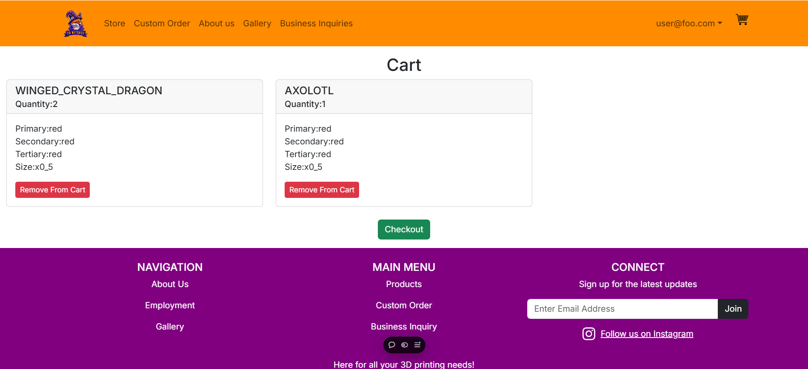
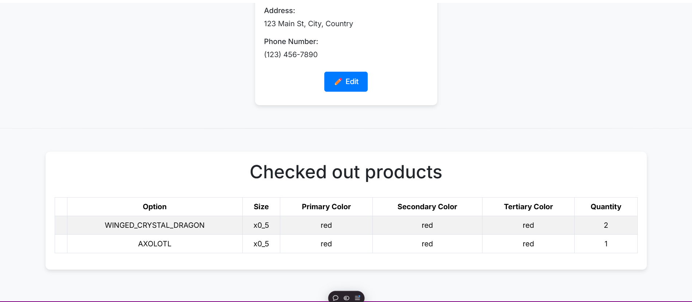
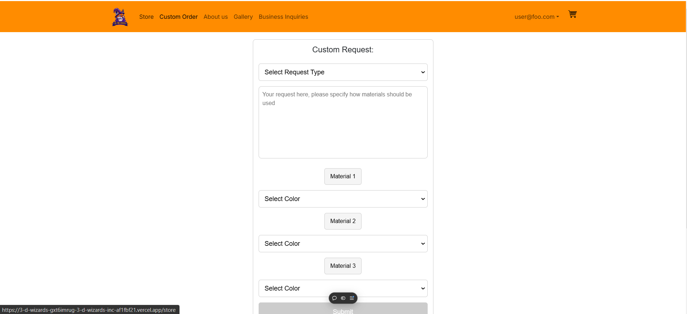
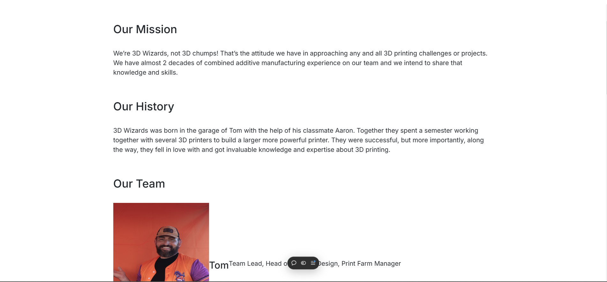
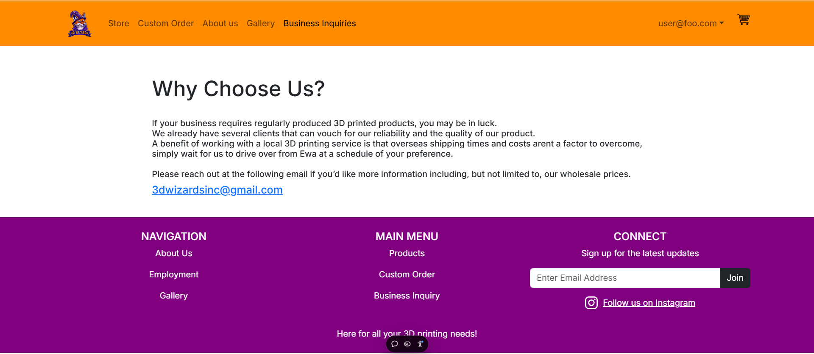

## Table of Contents

- [Overview](#overview)
- [Approaches](#approaches)
- [Use Cases](#use-cases)
- [User Guide](#user-guide)
  - [Landing Page](#landing-page)
  - [Creating an Account](#creating-an-account)
  - [Store Page](#store-page)
  - [Cart Page](#cart-page)
  - [View your orders](#view-your-orders)
  - [Custom Order Page](#custom-order-page)
  - [About Us Page](#about-us-page)
  - [Business Inquiries Page](#business-inquiries-page)
- [Community Feedback](#community-feedback)
- [Developer Guide](#developer-guide)
- [Milestone Project Pages](#milestone-project-pages)

## Overview

3D-Wizards Inc. is a business that develops and sells 3D printed products. The web application for the online store is currently under development, but the final application will allows users to browse items, make orders, and get in contact with the business owners.

The Problem: For the past year we have been a popular staple of physical marketplaces like the Aloha Stadium Swap Meet, the Lineup at Wai Kai, and the Pearlridge Center just to name a few. However we have a disappointingly finite stock and variety of options. In theory we should be able to quickly turn around custom orders, especially custom colors of products we already produce, due to the nature of 3D printers. However we're so focused on having enough normal stock for our locations that we don't have time to check and respond to instagram DM's or emails with lucrative custom orders. People also are unclear about their options when it comes to what we regularly make and how to order in bulk.

The Solution: We want to build my company a website where prospective customers can easily put in orders, with an admittedly overwhelming number of custom options, in a welming user-interface. 

Our team contract with all of the member's signatures can be found [here](https://docs.google.com/document/d/1khLUqeU3P_N2-VMSdp-ibR_amM5T2jIwDZtIPfz1X4s/edit?tab=t.0), and the [GitHub organization](https://github.com/3D-Wizards-Inc) contains the repositories associated with this project.

## Approaches

Our implementations have gone very smoothly. At the moment our site could absolutely be used to improve the productivity of the real 3D Wizards buisness. We will actually be making the whole site more practically usable in the near future but most of the features work well and as we had hoped.

### Online Store

- Potential customers should be able to browse a wide variety of our products.
- Customers should be able to add items to their cart and checkout.
- Even just sending us the requests this way would drastically improve productivity but a stretch goal would be to actually process payments through the web application instead of in person on delivery.

### Custom Orders

- We designed a graphical interface to choose specific custom colors/filament materials for different parts of the 3D model.

### Business Collaboration

- We have options for how we can collaborate and how a business can move forward with working with us.

## Use Cases

- We have had people approach me to print all the individual pieces for an Iron Man suit or a knight's armor, the custom project page would be perfect for this.
- Many parents want to buy a specific toy for each child in their life in their favorite color, the basic shop page would make this drastically easier.
- A business that wants to either start mass producing a product or even just get a prototype could take advantage of this webapp.

## User Guide

This section will guide the user through all of the implemented functionality of the online store. The website deployed to Vercel can be accessed [here](https://3-d-wizards-inc-two.vercel.app/).

To fully test the web app, use the following admin login:
email: temptestadmin@314.com
pw: tester

### Landing Page

This is the home page of the store, which all users will initially be directed to. From the navbar, various pages and functionality can be accessed such as creating an account and browsing the store page.

### Creating an Account

Users will initially want to create an account. This can be done via the dropdown on the right side of the navbar. Once a user makes an account the user is free to browse all the pages, pick which products they want, add them to their cart, and eventually check out. Above is the account page that users will be directed to after creating an account

### Store Page

Customers are able to browse the full catalog of items as well as use the left column search for items. Clicking on a product will lead to a subpage where users can specify the quantity and colors of their order.

## Cart Page

Once a user has submitted their order, it will show up on their cart page which can be accessed on the right side of the navbar. Here, users can remove items from their cart or proceed to checkout their order.

## View your orders

The account page will also display all past orders the user has made

### Custom Order Page

Sometimes, customers will want something a little more specific. In the custom order page, they can choose to modify a version of a product in the store or request a completely custom 3D design. Users are required to fill out the text box to provide additional information on their custom order and can also choose up to three colors

### About Us Page

### Business Inquiries Page

# Community Feedback

  
"This website is amazing and very easy to use! I can’t believe that my friend (and her classmates) made this! Only thing for me is that on my phone the home page is a little scrunched together but on PC it looks great!"

  
"Wow i am impressed. Very easy to use and easy to find what im looking for. Also the layout was simple. Cart need to be improved but well done"

  
"Maybe add more to the descriptions of the products and use an additional font. It also looks kind of weird on mobile, but other than that it looks like a legit website and I like all the options to customize each product and I also like the confirmation after adding an item or checking out."

  
"This website is very simple in layout and is very easy to navigate through. The complementary color scheme utilized is very appealing and unique to the branding of the website. The use of imagery for the products is very consistent in quality and the formatting is clean and clear."

  
"The website was very user friendly. when creating the custom order, i appreciated that i could see a sample of the shades that i was choosing to get a better idea of what product i would receive. however, i would have liked to have some sort of example or description for the products and what would be considered primary, secondary & tertiary colors on the order. i did find a few small grammar/capitalization errors on the site but nothing that took away from the overall design and functionality of the website. a personal preference of readability and design: i did not like the three columns on the home page of the website."

  
"This website looks good but looks funky on mobile. On mobile, the paragraphs on the main page looks crowded and the sign up page also looks really thin. But other than that I can check out items just fine."

Overall, there is a lot of constructive criticism to take away from the feedback we recieved. While the website seems easy to use and functions well, some things can be improved. In particular, the website not looking to standard on mobile devices is the main criticism we have noticed, as well as additional product descriptions and general aesthetics of the site.

## Developer Guide

This section will guide a developer through the process of downloading, installing, and modifying the system.

1. #### Cloning the repository
   First, developers will need to clone the repository to their workspace. In the [github organization](https://github.com/3D-Wizards-Inc), the project's repository can be accessed and cloned.

2. #### Installing packages
    Before doing this, developers will need to use Node.js to execute the code. To install all required packages, the developer can run "npm install".

3. #### Modifying the system
    Now that the required packages are installed, the project can be modified to implement changes or debug issues. To test changes before commiting, the developer will need a postgres server running and then run the command "npm run dev". This will run the project on the user's local host. After commiting and pushing changes, the vercel project will automatically deploy and the website may be viewed on vercel.

## Milestone project pages

The milestone pages show which issues were completed for that milestone and which team members worked on the issues.

[Milestone 1](https://github.com/orgs/3D-Wizards-Inc/projects/1/views/1)    
[Milestone 2](https://github.com/orgs/3D-Wizards-Inc/projects/2)    
[Milestone 3](https://github.com/orgs/3D-Wizards-Inc/projects/3)
