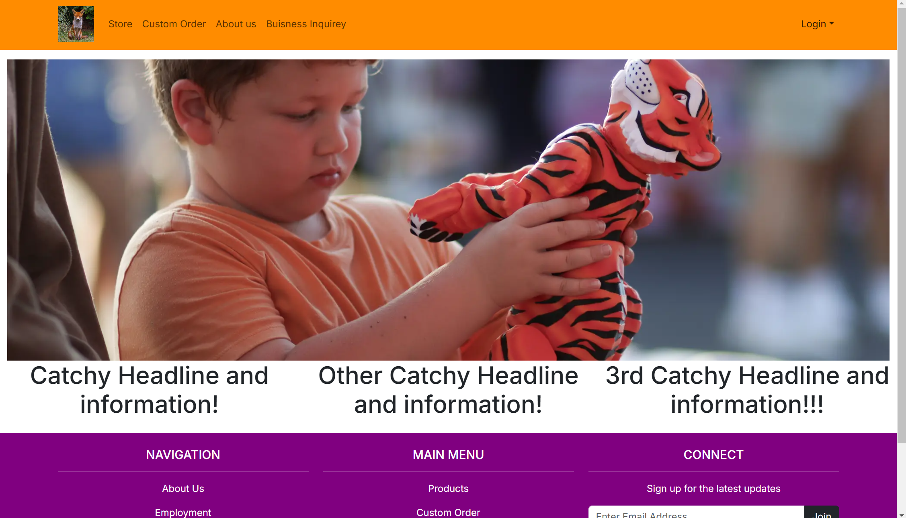
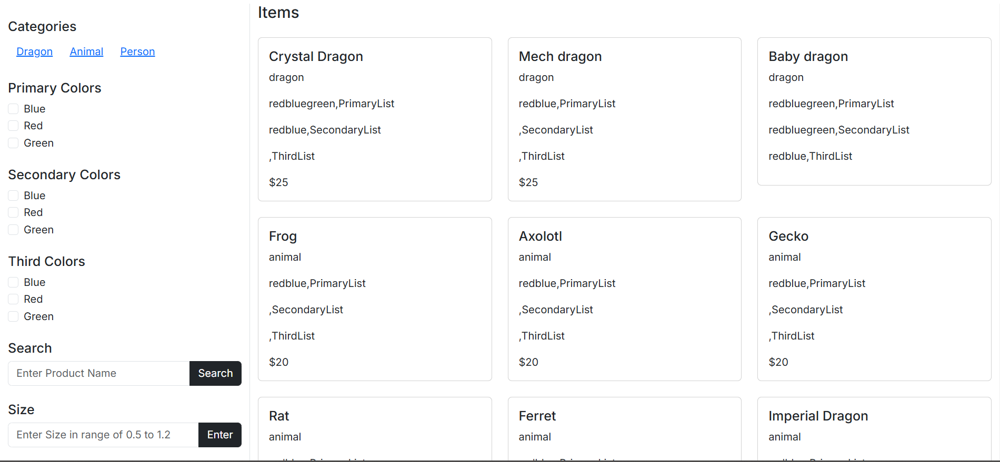
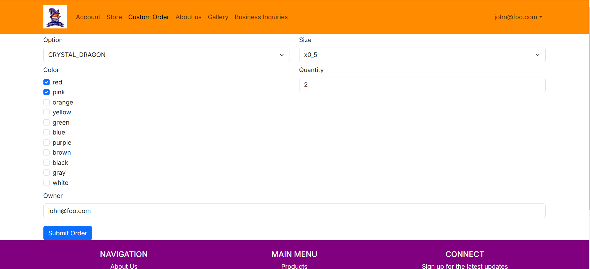
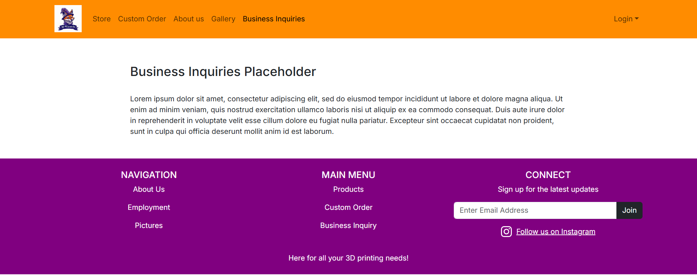

## Overview

3D-Wizards Inc. is a business that develops and sells 3D printed products. The web application for the online store is currently under development, but the final application will allows users to browse items, make orders, and get in contact with the business owners.

The Problem: For the past year we have been a popular staple of physical marketplaces like the Aloha Stadium Swap Meet, the Lineup at Wai Kai, and the Pearlridge Center just to name a few. However we have a disappointingly finite stock and variety of options. In theory we should be able to quickly turn around custom orders, especially custom colors of products we already produce, due to the nature of 3D printers. However we're so focused on having enough normal stock for our locations that we don't have time to check and respond to instagram DM's or emails with lucrative custom orders. People also are unclear about their options when it comes to what we regularly make and how to order in bulk.

The Solution: We want to build my company a website where prospective customers can easily put in orders, with an admittedly overwhelming number of custom options, in a welming user-interface. 

Our team contract with all of the member's signatures can be found [here](https://docs.google.com/document/d/1khLUqeU3P_N2-VMSdp-ibR_amM5T2jIwDZtIPfz1X4s/edit?tab=t.0).

## Approaches

There's many customer service processes in our company that I think could be streamlined, improved, or introduced with this website. Here are a few of my goals and hopes as well as their implementation.

### Online Store

- Potential customers should be able to browse a wide variety of our products.
- Customers should be able to add items to their cart and checkout.
- Even just sending us the requests this way would drastically improve productivity but a stretch goal would be to actually process payments through the web application instead of in person on delivery.
- In-Store pick-up and Shipping will be options which will have different check out prompts.

### Custom Orders

- We will design a graphical interface to choose specific custom colors/filament materials for different parts of the 3D model.
- There will also be another option to upload a 3D file of the customer's choosing along with material instructions as a requisition.
- There should be a cost and wait time estimator even if it's not entirely accurate at first before proper implementation.

### Business Collaboration

- We will also create a request form for businesses to reach out for a more involved partnership and longer-term business deal.
- Should allow for uploading images and a proposition.

## Mockup page ideas

- Home Page
- Signin/Signup/Account(Purchase History)
- Product List Page
- Custom Order Request Page
- Buisness Proposition Page
- Checkout Page

## Use Cases

- We have had people approach me to print all the individual pieces for an Iron Man suit or a knight's armor, the custom project page would be perfect for this.
- Many parents want to buy a specific toy for each child in their life in their favorite color, the basic shop page would make this drastically easier.
- A business that wants to either start mass producing a product or even just get a prototype could take advantage of this webapp.

## Current State of the Project

We have completed milestone M1 and M2, which consists of the landing page,  about us page, and business inquiries page as well as working 1st drafts of the store, custom order, and cart pages. We have sucsesfully began using database features to customize and add a product to the users cart which can be viewed on the cart page. To view the repositories and source code of our project, our [github organization can be viewed here](https://github.com/3D-Wizards-Inc).

### Landing Page

### Store Page

Customers are able to browse the full catalog of items as well as use the left column to filter items by categories, colors, and size. A search bar is also included.

### Custom Order Page

Customers are also able to put in their own custom order by first choosing a product, then specifying the colors, size, and quantity of their order. Submitting an order adds and entry to the prisma database, which is able to be viewed in the cart page.

### About Us Page

### Business Inquiries Page

### Deployment

The current website deployed on vercel can be accessed [here](https://3-d-wizards-inc.vercel.app/).

## The Next Steps

Our current goal is the [M3 project](https://github.com/orgs/3D-Wizards-Inc/projects/3), which finalizes the Ui of the pages we got working in M2. 
